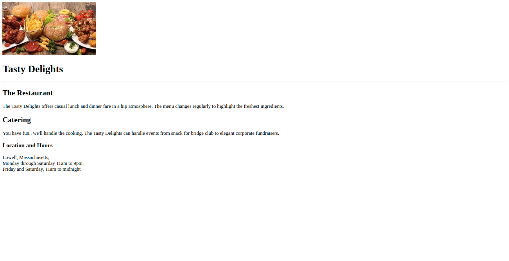

# Tasty Delights

## Context

Stevan Grace, master chef and author, runs the "Tasty Delights" Restaurant with his family in Lowell, Massachusetts. He wants to widen his business by increasing their visibility among web customers and hence planned to create a simple website to attract them.

With a clean and simple design, the website should draw all its viewers’ attention to the food. The backgrounds are white with fonts in plain black text. This shall make the images of their food the sharpest and brightest colours on the page, naturally making them stand out. 

As the first step, you are required to create a simple web page to highlight the restaurant details in a simple, elegant manner to attract the web customers.

### Problem Statement

Create a replica of a simple web page as shared in the image below.

### Tasks:

The solution of thie practice contains 8 steps.

#### Step 1: Add Image

- Open the `index.html` file provided inside the boilerplate code​.
- Inside the body tag, add img tag to add image​.
- The image to be added is available inside `images` folder inside the boilerplate.​
- Open the page in Live Server to check the output. 

#### Step 2: Add Heading

- Inside the body tag, add h1 tag to add page heading after the image.​
- The heading should contain following text​: `Tasty Delights`.
- Add a horizontal rule using `
` tag.

#### Step 3: Add Sub-Heading

- Inside the body tag, after the horizontal rule, add sub heading​.
- Use h2 tag to create sub heading​.
- The sub heading text should be `The Restaurant`.

#### Step 4: Add Paragraph

- Inside the body tag, after the sub heading `The Restaurant`, add paragraph using p tag.
- The text for the paragraph should be:`The Tasty Delights offers casual lunch and dinner fare in a hip atmosphere. The menu changes regularly to highlight the freshest ingredients.`

#### Step 5: Add Sub-Heading
- Inside the body tag, add one more sub heading using h2 tag.​
- The sub heading text should be `Catering`.

#### Step 6: Add Paragraph
- Inside the body tag, after the sub heading “The Restaurant”, add paragraph using p tag.​
- The text for the paragraph should be​: `You have fun.. we'll handle the cooking. The Tasty Delights can handle events from snack for bridge club to elegant corporate fundraisers.`

#### Step 7: Add Sub-Heading
- Inside the body tag, add one more sub heading using h3 tag.​
- The sub heading text should be `Location and Hours`.

#### Step 8: Add Paragraph
- Inside the body tag, after the sub heading `Location and Hours`, add paragraph using p tag.​
- The text for the paragraph should be​: `Lowell, Massachusetts;​
                                         Monday through Saturday 11am to 9pm,​
                                        Friday and Saturday, 11am to midnight`
- Use br tag to create line breaks within the paragraph.

