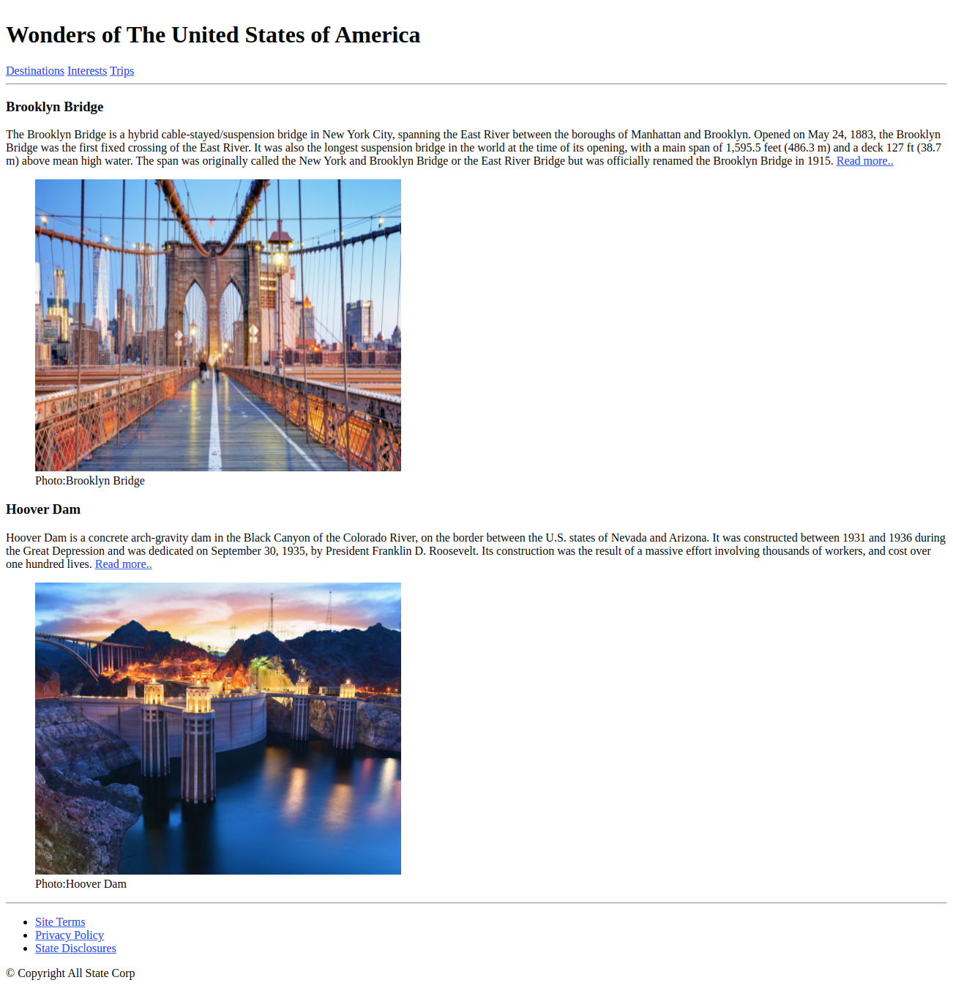

# Engineering Wonders of United States of America

Our world is filled with the most unique structures that are both man-made and natural. Some of the man-made creations include churches, tombs, temples, monuments, mosques, buildings and even cities. These structures have withstood the test of time and they continue to leave many awestruck with their brilliance. There are many in the world, but only few are selected, which are deemed to be the best.

## Problem Statement

Create a web page using HTML5 semantic elements that lists down two engineering wonders of the United States of America​.

Being a developer you are assigned with the task of creating a web page that resembles the below image.


### Tasks
- The solution for this practice can be developed in 3 steps:​
    - Step 1: Create Header
        - Use header, h1, nav, and anchor elements. 
    - Step 2: Create Main Content section
        - Use article, section, heading (h1), paragraph, anchor, figure, and figcaption elements.
    - Step 3: Create footer 
        - Use footer, section, unordered lists, anchor, and paragraph elements.
        - Use &copy; to get the copyright symbol.

- Edit `index.html` file to add various semantic HTML elements to get the page output as shown in the image.
- Use appropriate semantic elements to accomplish this outcome.
- Following are the text used:
```
Brooklyn Bridge

The Brooklyn Bridge is a hybrid cable-stayed/suspension bridge in New York City, spanning the East River between the boroughs of Manhattan and Brooklyn. Opened on May 24, 1883, the Brooklyn Bridge was the first fixed crossing of the East River. It was also the longest suspension bridge in the world at the time of its opening, with a main span of 1,595.5 feet (486.3 m) and a deck 127 ft (38.7 m) above mean high water. The span was originally called the New York and Brooklyn Bridge or the East River Bridge but was officially renamed the Brooklyn Bridge in 1915.Read more..

https://en.wikipedia.org/wiki/Brooklyn_Bridge
Photo:Brooklyn Bridge

Hoover Dam

Hoover Dam is a concrete arch-gravity dam in the Black Canyon of the Colorado River, on the border between the U.S. states of Nevada and Arizona. It was constructed between 1931 and 1936 during the Great Depression and was dedicated on September 30, 1935, by President Franklin D. Roosevelt. Its construction was the result of a massive effort involving thousands of workers, and cost over one hundred lives.Read more..

https://en.wikipedia.org/wiki/Hoover_Dam
Photo:Hoover Dam

Site Terms
Privacy Policy
State Disclosures
Copyright All State Corp

```
    


