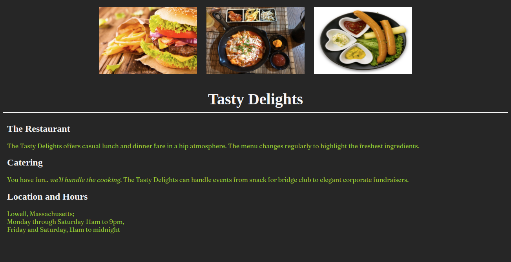

# Tasty Delights

## Context

Stevan Grace, master chef and author, runs the "Tasty Delights" Restaurant with his family in Lowell, Massachusetts. He wants to widen his business by increasing their visibility among web customers and hence planned to create a simple website to attract them.

With a clean and simple design, the website should draw all its viewers’ attention to the food. The backgrounds are dark with fonts in pale light shades. This shall make the images of their food the sharpest and brightest colours on the page, naturally making them stand out. 

As a web developer, you are required to style the web page to highlight the restaurant details in a simple, elegant manner to attract the web customers.

### Problem Statement

Use CSS3 style properties to style the landing page of Tasty Delights restaurant.Create a replica of a simple web page as shared in the image below.

### Tasks

- This practice is a continuation of Practice 2 – Tasty Delights of Sprint 1.​
- The web page created for the Tasty Delights need to be styled using CSS properties.
- The solution for this practice can be developed in 4 steps:​​​
    - Step 1: Define styles in `styles.css` file located in `css` folder
    - Step 2: Link the `styles.css` file with `index.html​`​ using `<link>` tag​
    - Step 3: Link the google font stylesheet with `index.html` using `<link>` tag​
      `<link href="https://fonts.googleapis.com/css2?family=Fraunces" rel="stylesheet">`​
    - Step 4: Apply styles defined using class or id selector to the page elements

### Define styles
- Use the style properties listed below to style the page elements.​

|Element/Class Name|Style Property|Style Property Value|
|---|---|---|
|body|background|#262626
|img|width|250px|
|img | height|170px|
| | padding|10px|
|h1|text-align|center|
| |font-size|40px|
| |font-family|serif|
||color|whitesmoke|
| |border-bottom|2px solid whitesmoke|
| |padding-bottom|10px|
|h2|color|whitesmoke|
|||font-family|serif|
| |padding-left|10px|
|p|font-family|Fraunces|
| |color|yellowgreen|
| |padding-left|10px|
|.center|text-align|center|

