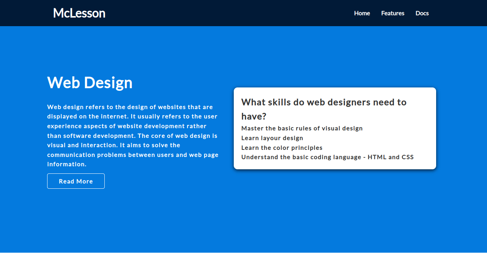
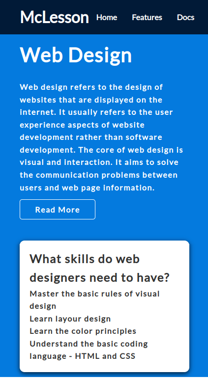
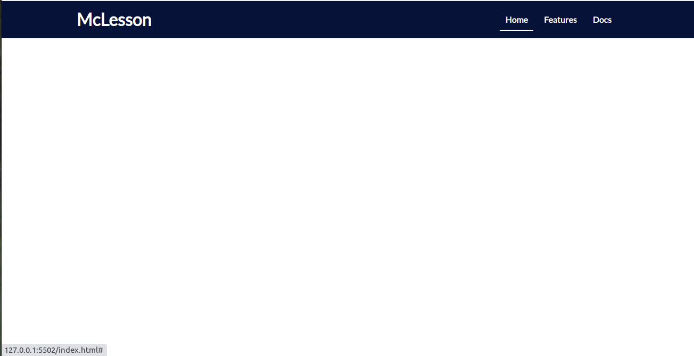

# Develop a Responsive Web Page for McLesson

# Context

McLesson is an online course platform which provides learning content for various IT streams. It provides an easy-to-use interface, high-quality content, and a variety of courses to choose from. The interface is simple and easy to navigate, so you can quickly find the information you need. ​
​
As a first step, you need to develop the landing page of McLesson website.

## Problem Statement

Develop a landing page for McLesson that contains a header with a brand name, navigation links, and a primary unit to present the core idea of the web page.  The web page should be optimized for both desktop and mobile devices. 

The web page should resemble the images as shown below.

## Tasks
- The HTML code for the page design is provided in the `index.html` file.
- Define styles inside the `style.css` file located in the `css` folder. 
    - Use CSS3 flex and grid layouts for styling page components.
- Following steps should be performed to build the solution for this practice.​
    - Step 1: Apply the global styles​
    - Step 2: Apply styles to the Header​
    - Step 3: Apply style to the Hero Unit / Primary Unit​
    - Step 4: Apply styles using media queries to make the web page responsive

### Step 1: Apply the global styles
- Use the Google Font "Lato" for styling fonts by adding the following font link in the index.html file.​
    `https://fonts.googleapis.com/css2?family=Lato&display=swap`​
- Add the style "box-sizing: border-box" to include the margin, padding and border in an element's total width and height.​
- Use line-height property for paragraph and list item contents to achieve the expected output.

### Step 2: Apply styles to the header
- he header should contain the brand name and nav-links in the same line and should be styled using the CSS3 flex property to achieve the below given layout.​
    - Brand name should be aligned to the left of the header and nav links should be aligned to the right of the header.​
        - Use "justify-content" and "align-items" to achieve it.​
- The navigation links should be listed using an unordered list.​
    - List items should appear adjacent to each other by applying flex property to <ul> element.​
    - All navigation link texts should not be underlined.​
    - An underline should appear when the mouse is hovered over the nav links.​
    - Use anchor pseudo class and border-bottom property to achieve this effect.​
    - Apply appropriate margin and padding properties to get the expected output for the nav links.​
- The background color and font color details are available in the boilerplate.

### Step 3: Apply styles to the Hero Unit/ Primary Unit
- The hero unit section contains a two-column layout which should be styled using the CSS3 grid property.​
    - The grid should contain two columns with the first column occupying 45% of total width and the second column occupying 55% of total width available.​
        - Use "grid-template-columns" to specify the width for the columns.​
    - The gap between the columns should be 20px.​
    - The contents of the columns should be aligned in the centre horizontally as well as vertically.​
        - Use "justify-content" and "align-items" to achieve it.​
- The first column content of the grid should contain a heading, paragraph and button. ​
    - Use letter-spacing property to achieve the desired output for the paragraph content.​
- The second column content of the grid should contain a heading with list items and should be presented as a card. ​
    - Use the box-shadow property to view it like a card.​
- Apply appropriate margin and padding properties for paragraph, button and card.​

### Step 4: Apply styles using media queries

- To achieve responsive web page, use media queries to apply the below styles for screens with max-width of 480px.​
    - The hero-unit section should contain a single-column grid which occupies 100% of total available width.​
        - Use "grid-template-columns" to specify the width of the column.​
    - The height of the hero-unit section should be increased to accommodate the page contents.​

### Details

- Color codes used in this web page are:
    - #047ade (Hero unit)
    - #fff (Font color for nav links and hero unit text contents)
    - #333 (Text inside card)
    - #011a37 (Navbar background color)
    - Black (box-shadow)
- Font family used is:
    - Lato, san-serif